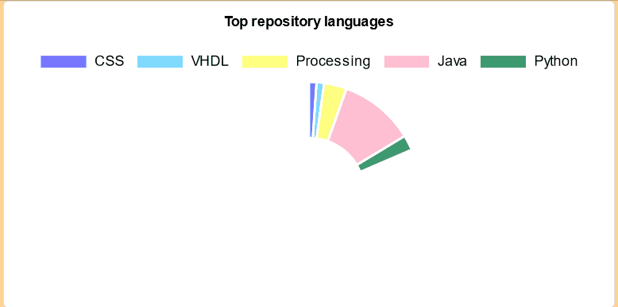
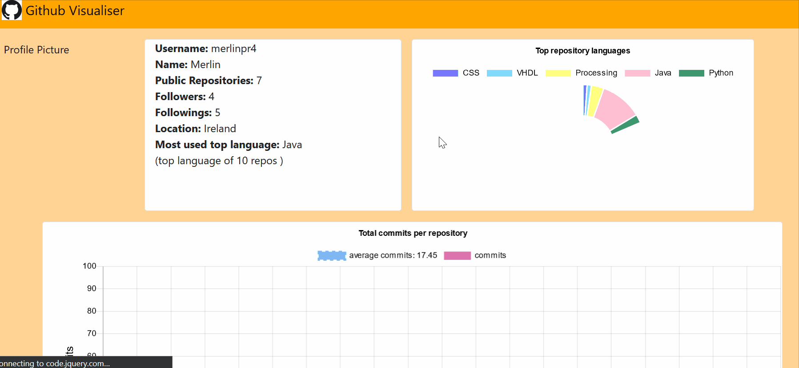
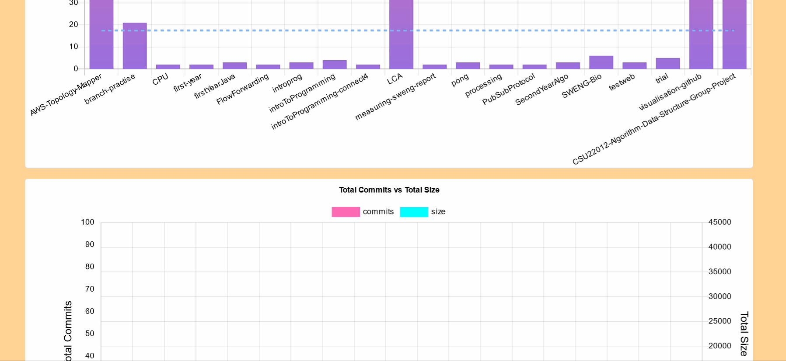
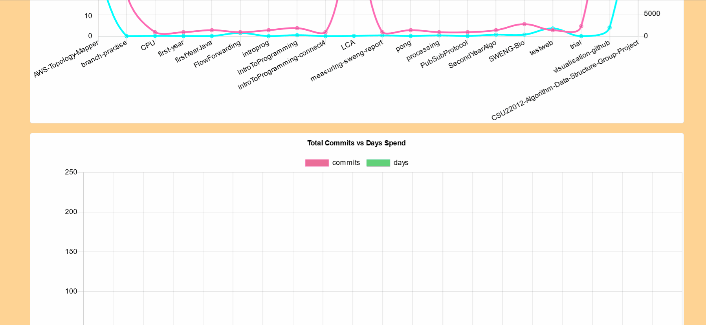

# Visualisation-Github

## Overview :
Check out the data from my github account here : https://merlinpr4.github.io/repovisual/

This is a visualisation of metrics from a github user's repositories which can be used to help in the software engineering process.  
It pulls data from the Github Rest API ( https://docs.github.com/en/rest).

There are two folders accessing github api and visualise .  
The visualise folder contains all relevant files for the actual visualisation of my project  
The api-access folder shows my first attempts at interacting with the Github API. 

## Dependencies
- Python 3
- Pip
- PyGithub
- Docker
- PyMongo

## How to run:
Live version :  https://merlinpr4.github.io/repovisual/

There are bat files available for quick use on windows

### Initial  setup
1. Have python 3 installed on laptop
2. git clone this repo
3. Cd into the visualise folder
4. Have pip installed on laptop ( python3 get_pip.py )
5. Install pyGithub on laptop using pip (pip install pyGithub )
6. pip install pymongo
7. cd into visualise folder
8. start mongodb container (docker-compose up)

### Run with prefetched data
1.  Type python3 -m http.server to make the graphs  on localhost:8000 (server to run bat script)
2. Go to localhost:8000 (http://localhost:8000/) to see the visualisation.   The webpage should display the previously fetched information

### Run with personal access token 
1.  Cd into the visualise folder
2.  Go to api.env  and write in your personal access token into the TOKEN (TOKEN = "place-token-here").   If you want to use a username instead replace the NAME = "merlinpr4" with the username you wish to look up but this can get rate limited. If neither is supplied it automatically defaults to my github account.
3.  Type python3 cleardb.py to clear the previous files in the repo and database (clear to run the bat script)
5.  Type python3 getdata.py to access the basic data of the user file and store it in the database (gather  to run the bat script).
6.  Type python3 processdata.py to process the data in the database and create csv files (process to run the bat script).
7.  Type python3 -m http.server to make the graphs on localhost:8000 (server to run bat script)
8. Go to localhost:8000 (http://localhost:8000/) to see the visualisation of the data fetched

## Motivation:
I focused my analysis on the github repositories of a user in order to see if I could gain an insight into the user behaviours.
I thought that if I was able to analyse all the repos of a specific user I would notice common attributes as well as see how good of a metric total commits in a repo was in measuring software engineering. I assumed that such metrics could be used to judge how many commits it would take them to do a similar project to one they have already done. Aswell as this I examined their top repo language to see the users proficienc in different programming languages

## Discussion :

The backend is written in python3 and is supported by a mongodb database with API access done through PYGithub . The frontend is written in HTML,CSS and Javascript with the help of chart.js and bootstrap.  
I used the professor's examples on using python to access Github as a starting point.  

This was my first time using an API and a database. I was also a beginner in python. So predictably I had some initial struggles using the API to get the data . Thankfully I was able to get the info I needed and visualise it. I spend a lot of time on the visualisation aspect as I was also a beginner in using chart.js and javascript. Nonetheless I think my graphs are quite interactive and look visually pleasing. Using two programming languages I wasn't familiar with was a struggle at the start but I think it paid off in the end as now I have gained a lot of valuable experience.

### Top language chart
  
The language doughnut chart shows a compilation of all the users' top used programming languages.  My idea behind this was by counting only the main language of the repo I could see their proficiency in that language by the number of repos they used it in. I thought counting this might be more interesting than counting the lines of code of each language used in a repo as some languages such as HTML require a lot of lines to write compared to Python but if I just count the top language of repos then languages the contribution of HTML ,CSS etc won't be as skewed as they will only be counted once.  The doughnut chart also shows the % the language is in the repo and recalculates when the data displayed  is changed.

### Total Commits barchart
  
This barchart shows all the repos of the user with the total number of commits that have been done . The horizontal line visualises the average of all these commits so you can compare the number of commits in the repos versus the average.  The tooltip also shows what % the specific repo accounts for the overall total . Usually projects which require more work require more commits and this information is not that useful without also being aware of the number of contributors,size etc so I also included that information in the tooltip. One big thing I noticed however was that because I only started using Github properly this year a lot of my older projects only have 1/2 commits total because I uploaded the completed project to github and did not use it from the start. I think a manager could use these stats in order to estimate how many commits it would take this particular user to finish a similar project to one they have already done. 

### Total Commits vs Size
  
These line graphs compare total commits in a repo vs total size. I wanted to see if there was a correlation between these two metrics as I believed normally the more times you commit the bigger the repo would be.  While that was generally the case as I mentioned before in cases where an already finished project was submitted this would not be reflected properly. Also for projects which contain a large amount of data in files like json and csv the size and commits would not fully correlate. However overall I think I do see a positive correlation between the two metrics.

### Total Commits vs Days
  
This barchart compares the total commits vs the days spend on the repo. The way I calculated the days was by counting the days between when the repo was created and its final push. This made sense to me as I would normally create a repo when I am about to start a project and my final push would be around the last day. I thought this would then also help for accounting for days when the user wasn't coding but was still working on the project such as when they are planning what to do next. I assumed the higher number of days a project had the higher the total commits would be . This was usually the case with commits slightly higher than the total days spent. One issue is that however if the user makes a small change to the repo after a long time has passed it would heavily affect the total days. This is probably why software engineers usually measure active days as this accounts only for the days coding. Once again total days spent without further information regarding the project difficulty isn't a great metric. However a manager could use these stats to try to estimate how long a similarly difficult project would take.

## Conclusion :
In conclusion total commits of a repository on its own is not a great metric in measuring software engineering. However used in addition to other stats from the repository it should allow for estimating metrics for a similar project especially if the github user uses their account frequently for the project from start to finish.  
If I was going to do it again I would analyse commits metric further by looking at total additions versus total deltations in order to calculate code churn in a repository. 

Overall this project helped me learn a lot of new technologies and was a lot of fun. It made me aware of the pros and cons of different metrics as well as realise the amount of data a programmer generate

